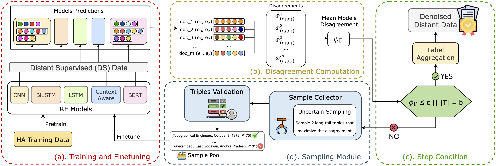

# DOREMI: Optimizing Long Tail Predictions in Document-Level Relation Extraction

Document-Level Relation Extraction (DocRE) presents significant challenges due to its reliance on cross-sentence context and the long-tail distribution of relation types, where many relations have scarce training examples. 

In this work, we introduce **DO**cument-level **R**elation **E**xtraction opti**M**izing the long ta**I**l (**DOREMI**), an active learning framework enhancing the representation of underrepresented relations through minimal yet targeted manual annotation. Unlike prior approaches that rely on large-scale noisy data or heuristic denoising, DOREMI actively selects the most informative examples to improve training efficiency and robustness. DOREMI can be applied to any existing DocRE model and is effective at mitigating long-tail biases, offering a scalable solution for improving generalization on rare relations.



## Contents

This repository contains the implementantion of **DOREMI** (**DO**cument-level **R**elation **E**xtraction opti**M**izing the long ta**I**l).  

The implementations of BiLSTM, CNN, ContextAware, and LSTM are taken from [DocRED](https://github.com/thunlp/DocRED/tree/master). The implementation of BERT is based on [DREEAM](https://github.com/YoumiMa/dreeam)[2], and [ATLOP](https://github.com/wzhouad/ATLOP)[3]. 

## Installation
DOREMI was run in a Python environment created with Singularity. File ```runDOREMI.def```contains the environment configuration. 

If you want to create a Singularity Image Format (.sif) using the definition file, run:
```
singularity build runDOREMI.sif runDOREMI.def
```

If you do not want to use Singularity, you can run DOREMI using a standard Python environment by installing the libraries listed in the definition file.

### Hardware
DOREMI was run on an Nvidia A40 (48GB). The RAM usage varies based on the module:
- Pretrain and Finetuning: 10Gb
- Evaluation on distant data: 200Gb
- Disagreement Computation and Sampling: 43Gb
- Label Aggregation: 10Gb
- Model Evaluation on the distant dataset: 23Gb  

## Datasets

DOREMI was run both on DocRED and Re-DocRED.

### DocRED
Download [DocRED](https://drive.google.com/drive/folders/1c5-0YwnoJx8NS6CV2f-NoTHR__BdkNqw) and place files ``dev.json``, ``train_annotated.json``, and ``train_distant.json`` inside the repository ``data/docred``.

Place file ``rel_info.json`` and the content of directory ``DOCRE_baseline_metadata`` in repository ``data/docred/meta``.

### Re-DocRED

Download [Re-DocRED](https://github.com/tonytan48/Re-DocRED/tree/main/data) and place files ``dev_revised.json``, ``test_revised.json``, and ``train_revised.json`` inside the repository ``data/redocred``.

Copy file ``train_distant.json``inside the repository ``data/redocred`` and the metadata files downloaded for DocRED repository ``data/redocred/meta``.

### Dataset Preprocessing (for CNN, BiLSTM, LSTM, and ContextAware)
To train CNN, LSTM, BiLSTM, and ContextAware datasets needs to be preprocessed. For each dataset needed during training run:
```
python prepro_data.py 
```
The scripts takes as arguments:
- ``in_path`` (str): path to the dataset to be preprocessed.
- ``out_path`` (str): where to save the processed dataset.
- ``filename`` (str): the name of the file to be processed.
- ``suffix`` (str): suffix for the file.
- ``isTraining`` (bool): whether the dataset is used for training (insert the argument if the dataset is used for training).

Repository ``data/scripts/prepro`` contains the scripts to pre-process DocRED and Re-DocRED datasets. For instance, to pre-process DocRED annotated training dataset, run from inside the repository ```src``` (does not require GPU): 

```
bash ../data/scripts/prepro/prepro_train_annotated.sh
```

## Running Experiments

DOREMI computation is split into independent modules. To ease reproducibility, we share the scripts we used to run each module. 

Scripts must be run from inside the repository ```src```.

We show how to run DOREMI pipeline using DocRED. Running it with Re-DocRED is identical. The scripts to run DOREMI using Re-DocRED has ```redocred``` in the name of the files.

### 1. Pretraining Module (a). Training and Finetuning
To pretrain a model using the DocRED annotated training dataset. Run (requires one GPU):
```
bash ../data/scripts/pretrain/pretrain_BERT.sh
```

Each script pretrains a single model. Thus, to pretrain all models you need to run five scripts.

### 2. Model Evaluation

To compute the disagreement between models and select the candidate triples, all models need to be run in inference mode on the DocRED distant dataset. To predict the relations on the DocRED distant dataset using BERT pretrained, run (requires one GPU):

```
bash ../data/scripts/eval/eval_preBERT_distant_micro.sh
```

Each script evaluates a single model on a single dataset. Thus, to evaluate all models you need to run five scripts.

If you wish to evaluate the performance of the models on the DocRED development dataset, you can follow the script ```data/scripts/eval_preBERT_dev_micro.sh``` as an example.

DOREMI supports micro-averaged evaluation (```--eval_mode micro```), macro-averaged evaluation (```--eval_mode macro```), and relationwise evaluation, i.e., evaluating precision, recall, and F1 for each relation in the dataset, (```--eval_mode per-relation```).

### 3. Disagreement Computation and Sampling: Module (b). Disagreement Computation and Module (d). Sampling

DOREMI samples the top-k pairs with highest disagreement from a pool of candidate long-tail triples. Thus, the disagreement is computed on these candidates to ease computational costs. 

1. To select the candiate long-tail triples run (does not require GPU):
```
bash ../data/scripts/sampling/candidate_selection_pretrain.sh 
```

2. To pre-process the candidates run (does not require GPU):
```
bash ../data/scripts/prepro/prepro_baselines_candidates_iter1.sh
```

3. To sample the triples to be annotated run (requires one GPU):
```
bash ../data/scripts/sampling/sample_candidates_agreement_logsum_iter1.sh
```
This script will generate a JSON file containing the triples to be annotated. 

We share the Jupyter notebook we used to visualize the document and the triples to be annotated in a more user-friendly manner at: ```notebooks/annotate_samples.ipynb```.

We share the jupyter notebook we used to produce the training file for the next iteration by merging the annotated sample and the current training dataset at: ```notebooks/merge_sample_to_train.ipynb```.

### 4. Finetuning: Module (a). Training and Finetuning
Once the annotation is completed, merge the annotated sample with the training file, place it in either ```data/docred``` or ```data/redocred``` repository, pre-process with the ```prepro_data.py```script and the models are finetuned on the new training dataset. 

To finetune a model run (requires one GPU):

```
bash ../data/scripts/finetune/finetune_BERT_iter1_agreement_logsum.sh
```

Each script finetunes a single model. Thus, to finetune all models you need to run five scripts.

### 5. Label Aggregation: Module (c). Stop Condition
Once the iterative training is completed, the predicted labels of all models on the DocRED distant dataset are aggregated. 

DOREMI aggregates aggregate predictions from the best iteration of each model – based on the highest long-
tail F1 on the development set – to construct the Distant Denoised Dataset (DDS). Thus, a json file stating which is the best iteration for each model is required to aggregate based on the best model and must be saved in ```data/docred/meta``` or ```data/redocred/meta```, respectively. The file ```model2bestit.json``` in the repositories ```data/docred/meta``` or ```data/redocred/meta``` contains the iterations we used to generate the DDSs we shared in the Data Appendix.

To aggregate the labels based on the best models predictions run (does not require GPU):
```
bash ../data/scripts/label_aggregation/merge_results_best_model_docred.sh
```

One can also aggregate the distant labels of the models on a specific iteration by replacing argument ```--best_model_file``` with argument ```--pred_mode``` stating the name of the repository containing the models checkpoint. 

To aggregate the labels based on the pretrained models predicitions run (does not require GPU):

```
bash ../data/scripts/label_aggregation/merge_results_pretrain_docred.sh
```


## References
[1] Yao, Y.; Ye, D.; Li, P.; Han, X.; Lin, Y.; Liu, Z.; Liu, Z.; Huang, L.; Zhou, J.; and Sun, M. 2019. DocRED: A Large-Scale Document-Level Relation Extraction Dataset. In Proceedings of the 57th Annual Meeting of the Association for Computational Linguistics, 764–777. Association for Computational Linguistics. [https://doi.org/10.18653/v1/P19-1074](https://doi.org/10.18653/v1/P19-1074).

[2] Ma, Y.; Wang, A.; and Okazaki, N. 2023. DREEAM: Guiding Attention with Evidence for Improving Document-Level
Relation Extraction. In Proceedings of the 17th Conference of the European Chapter of the Association for Computational Linguistics, 1971–1983. Association for Computational Linguistics. [https://doi.org/10.18653/v1/2023.eacl-main.145](https://doi.org/10.18653/v1/2023.eacl-main.145).

[3] Zhou, W.; Huang, K.; Ma, T.; and Huang, J. 2021. Document-Level Relation Extraction with Adaptive Thresholding and Localized Context Pooling. Proceedings of the AAAI Conference on Artificial Intelligence, 35(16): 14612–14620. [https://doi.org/10.1609/aaai.v35i16.17717](https://doi.org/10.1609/aaai.v35i16.17717).
